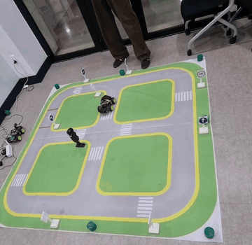
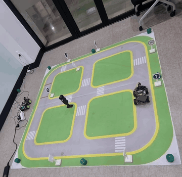
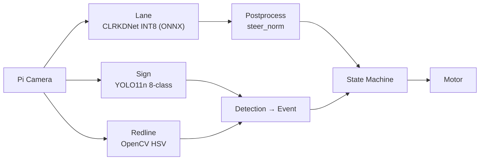
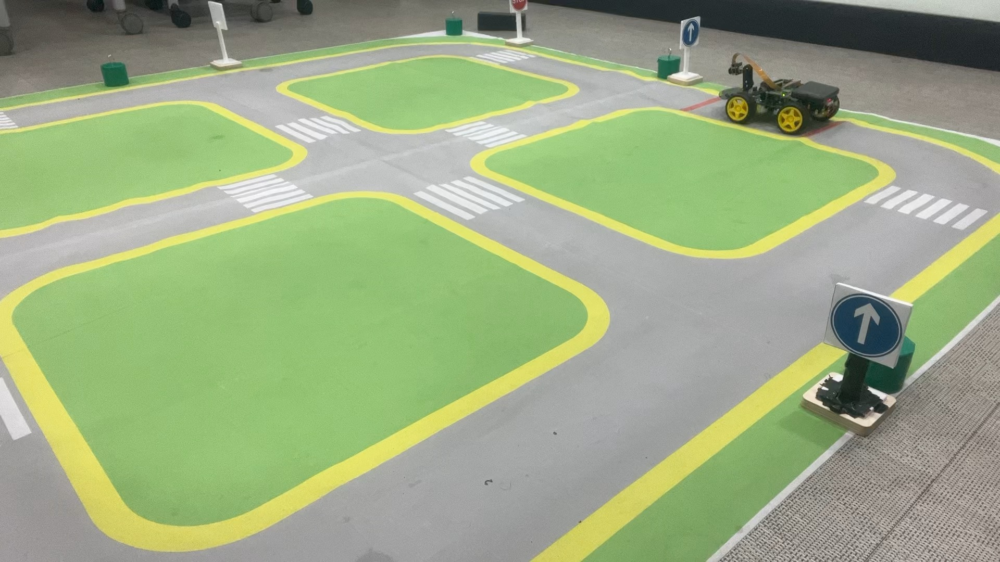
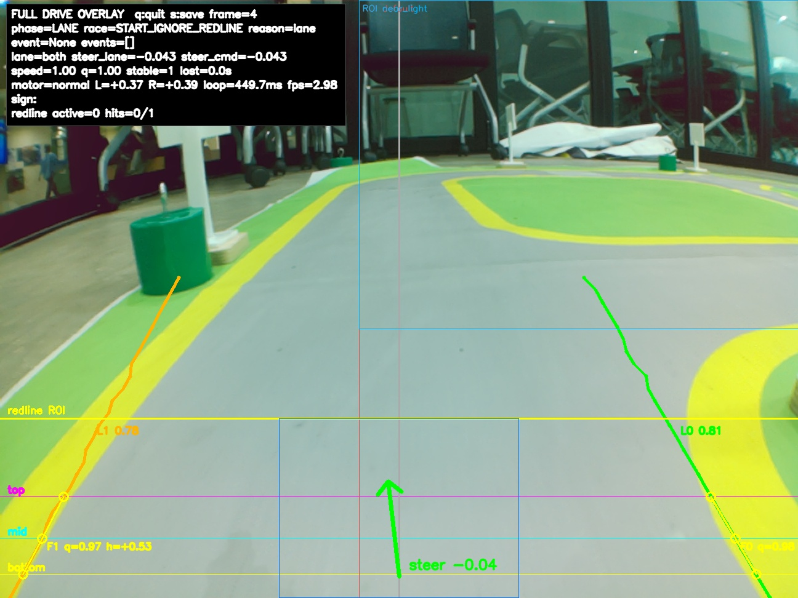

# Embedded AI Car

  
  

Raspberry Pi 5 CPU만으로 lane detection 모델을 실시간 주행이 가능한 수준까지 최적화하고, 표지판·신호등·종료선 인식을 하나의 주행 런타임으로 통합한 자율주행 RC카입니다.

광운대학교 **임베디드인공지능시스템최적화**(2026-1) 수업의 팀 프로젝트로 진행했으며, 이 저장소에는 그중 제가 설계하고 구현한 코드를 정리했습니다. 어떤 문제를 만났고 왜 이렇게 설계했는지는 [블로그](https://u-nsiq.github.io/Posts/Projects/Embedded-AI-Car/)에 기록되어 있습니다.

## 핵심 결과

- **Lane 모델 도메인 적응**: CULane 사전학습 CLRKDNet(ResNet-18)은 프로젝트 맵에서 그대로 동작하지 않았습니다. HSV pseudo-label을 거쳐 Local Fit 레이블 정책으로 학습 목표 자체를 재정의했고, 내부 검증 F1@IoU=0.50 기준 **0.4897에서 0.7478**까지 끌어올렸습니다.
- **임베디드 경량화**: Raspberry Pi 5 CPU에서 lane 추론 latency를 **약 376ms(FP32)에서 약 87ms(QAT-lite INT8)** 로 줄였습니다. 양자화 후보는 tensor 오차가 아니라 조향 행동이 보존되는지를 기준으로 검증한 뒤 채택했습니다.
- **주행 시스템 통합**: lane 조향, YOLO11n 표지판·신호등 인식, OpenCV 종료선 검출, 상태 기계를 하나의 멀티레이트 런타임으로 통합해 **최종 시연 코스를 완주**했습니다 (2026-05-28).

## 시스템 구성

세 인식 모듈은 하나의 루프 안에서 서로 다른 주기로 실행되며(멀티레이트), 이벤트의 수용 시점과 우선순위는 상태 기계가 결정합니다.

| 최종 차량 | 런타임 오버레이 |
| :---: | :---: |
|  |  |

## 저장소 구조

| 폴더 | 내용 |
| --- | --- |
| [`runtime/`](runtime/) | 최종 시연에서 주행한 Raspberry Pi 런타임 (시연 당일 상태 그대로) |
| [`label_pipeline/`](label_pipeline/) | 현장 수집 이미지로 CULane 형식 pseudo-label 데이터셋을 만드는 빌더 |
| [`notebooks/`](notebooks/) | 실험 노트북 (작업 단위 11개 폴더) |
| [`notes/`](notes/) | 강의 이론 정리 (Week 1–5) |

데이터셋과 학습된 모델 weight는 저장소에 포함하지 않습니다.

## Credits

- [CLRKDNet](https://github.com/weiqingq/CLRKDNet) / [CLRNet](https://github.com/Turoad/CLRNet): lane detection 모델과 디코딩 방식의 기반
- [Ultralytics YOLO11](https://github.com/ultralytics/ultralytics): 표지판·신호등 탐지 학습
- [CULane](https://xingangpan.github.io/projects/CULane.html): 사전학습 데이터셋과 레이블 포맷
